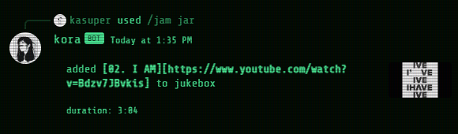

# kora

kora is a multi-functional Discord bot designed for shared enjoyment. The program is written in Javascript, powered by [Node.js](https://nodejs.org/en), and extensively utilises the [discord.js](https://discord.js.org/) library for its framework. Additionally, it leverages the [Discord Player](https://discord-player.js.org/) library to provide advanced music player functionalities.

## Getting Started

This guide outlines the steps to build your own Discord bot with the internals of kora on Windows. For other platforms, please refer to additional resources.

1. Create and set up a Discord bot following Discord's official [Getting Started](https://discord.com/developers/docs/getting-started).
2. [FFmpeg](https://ffmpeg.org/download.html) is used for media transcoding. Install and add its path to your user environment variables.
3. This program is powered by [Node.js](https://nodejs.org/en). _Node.js v16.20.2_ is used since later versions returned various errors.
4. Execute the following command to install dependencies:

   ```
   npm i dotenv discord.js @discordjs/opus discord-player @discord-player/extractor ytdl-core
   ```

   - [ytdl-core](https://github.com/fent/node-ytdl-core) was chosen as the YouTube streaming library since it allows for additional parameters for better quality audio.
5. Create a `.env` file and add your Discord bot `TOKEN` and `CLIENTID` details:

   ```
   TOKEN=<token>
   CLIENTID=<clientid>
   ```
6. Bring your Discord bot to life by executing `node .`

## Music Player Commands

| Command                           | Description                      |
| --------------------------------- | -------------------------------- |
| `/jam` `jar` `<url>`        | play song                        |
| `/jam` `barrel` `<url>`     | play playlist                    |
| `/jam` `bazaar` `<keyword>` | play first result from search    |
| `/fridge`                       | pause                            |
| `/feast`                        | resume                           |
| `/jump`                         | skip                             |
| `/souffle`                      | shuffle                          |
| `/soberup`                      | unshuffle                        |
| `/jukebox`                      | show currently playing and queue |

## Examples





## Coming Soon

We have exciting plans for future updates to enhance this project. Keep an eye out for upcoming features, including:

- **LLM/RAG Integration**: We are planning to integrate Large Language Models (LLM) such as Llama2 or GPT for chat functionality. Retrieval-Augmented Generation (RAG) is also being considered to provide user data to LLM, creating a more familiar environment without the need for retraining.
- **Games**: We are exploring games for users to play and engage with kora!
